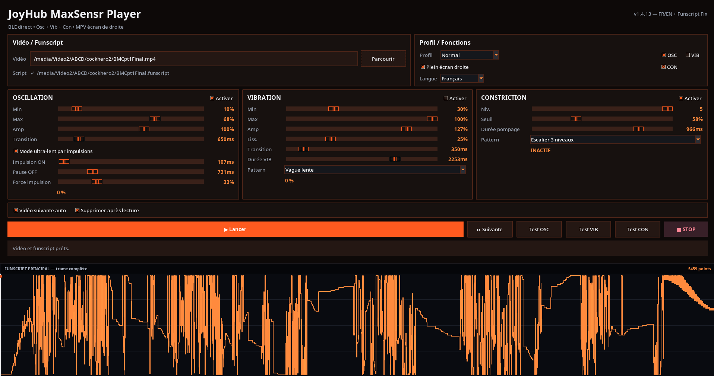
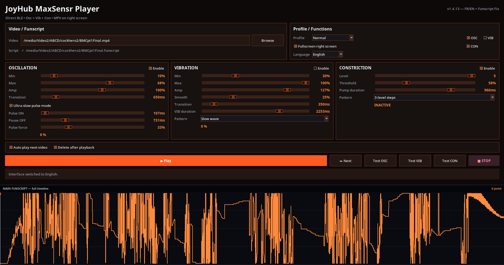

# JoyHub MaxSensr Funscript Player

Linux desktop player for the **JoyHub J-MaxSensr** with direct Bluetooth Low Energy control and synchronized `.funscript` playback.

The interface is available in **English and French** and can switch language directly from the application.

## Features

- Direct BLE connection to `J-MaxSensr`
- Synchronized video playback with MPV
- Automatic `.funscript` detection
- Oscillation (OSC), vibration (VIB), and constriction (CON) controls
- Independent enable/disable controls for OSC, VIB, and CON
- Live control adjustments during playback
- Ultra-slow OSC pulse mode
  - Pulse ON time
  - Pause OFF time
  - Pulse force
- OSC min/max, amplitude, and transition controls
- Vibration patterns and smoothing controls
- Constriction patterns, threshold, level, and pump duration
- Interactive full-timeline funscript graph
- Seek support with BLE reconnect handling
- Automatic next-video option
- Optional delete-after-playback
- French / English interface
- More tolerant funscript loader for standard JSON and concatenated JSON blocks

## Screenshots

### Français



### English



## Requirements

- Linux
- Python 3
- Tkinter
- MPV
- Python package `bleak`
- Bluetooth Low Energy adapter
- JoyHub `J-MaxSensr`

Example Debian/Ubuntu packages:

```bash
sudo apt install python3 python3-tk mpv python3-venv
```

Create a virtual environment and install the Python requirements:

```bash
python3 -m venv ~/venv-maxsensr
~/venv-maxsensr/bin/pip install -r requirements.txt
```

## Run

```bash
~/venv-maxsensr/bin/python MaxSensr-Funscript-Player-v1.4.13.py
```

Choose a video. The player looks for the corresponding `.funscript`, connects to the MaxSensr over BLE, and synchronizes the enabled functions with playback.

## Ultra-slow oscillation

The **Ultra-slow pulse mode** reduces the effective oscillation speed by driving OSC intermittently instead of continuously. The three live controls are:

- **Pulse ON** — how long the OSC motor is driven
- **Pause OFF** — how long it rests between pulses
- **Pulse force** — strength applied during each pulse

These controls can be adjusted while the video is playing.

## Safety

Start with conservative levels and verify the device response before increasing force or duration. Stop playback if the device behaves unexpectedly, overheats, stalls, or loses synchronization.

## Version

**v1.4.13 — FR/EN + Funscript Loader Fix**

Highlights of this release:

- French / English interface switching
- Live controls retained
- Ultra-slow OSC pulse controls retained
- Seek/reconnect fix retained
- Improved funscript loading for files that contain concatenated JSON blocks
- Improved dark combobox readability and accessibility

## License

No license has been selected yet. Add a `LICENSE` file before distributing the project under a specific open-source license.
